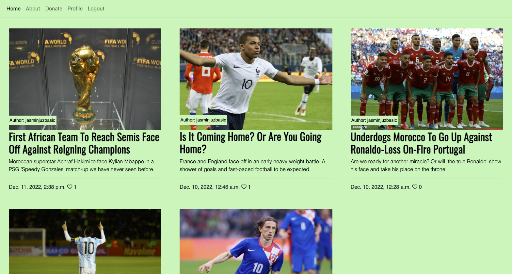
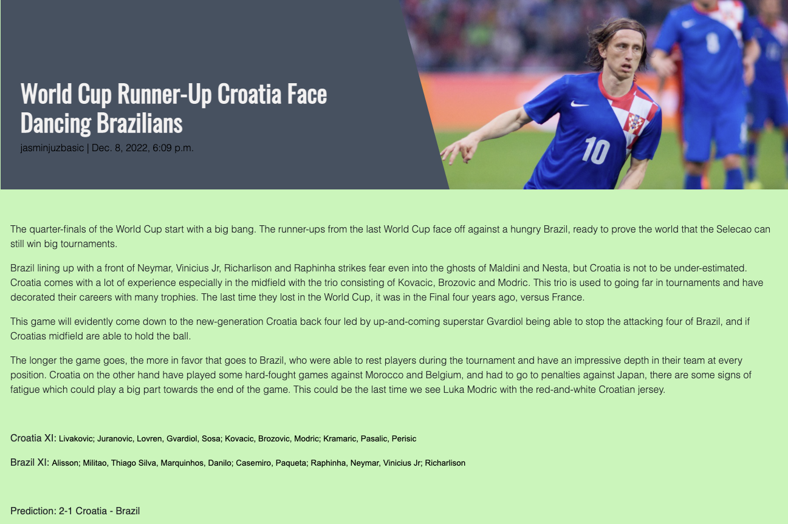
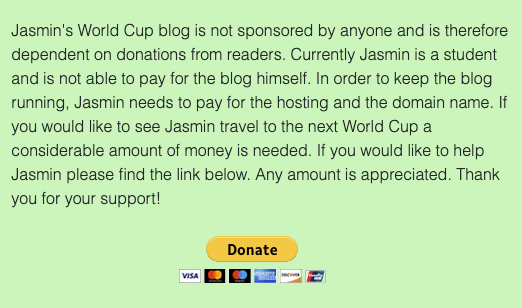
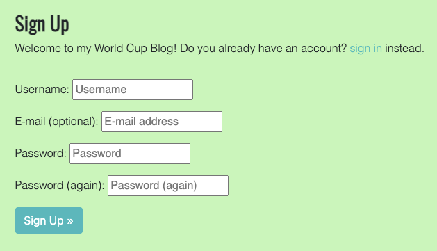
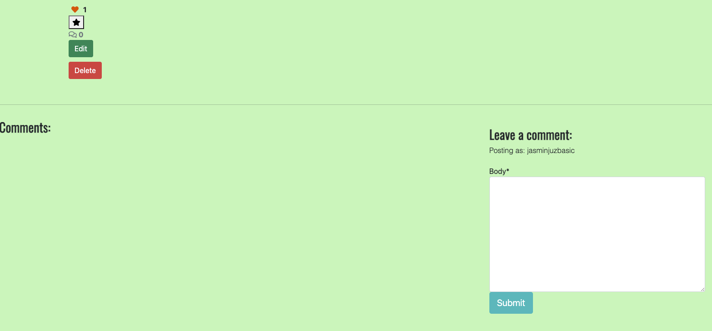
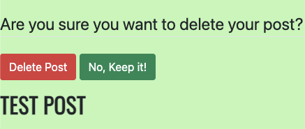
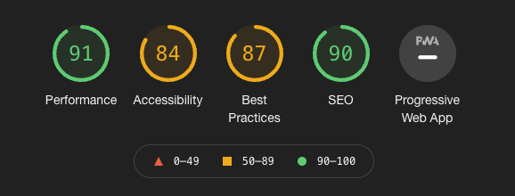

# Jasmin's World Cup Blog

- **Jasmin's World Cup Blog** is a place where you can find out about the latest news and updates regarding the World Cup 2022 in Qatar. Jasmin follows every game and every goal and will be posting relevant content during the duration of the Cup (and perhaps the next World Cup). The blog provides deep insight on the teams and and the players and gives predictions for the tournament. Jasmin/the creator of the site is a huge football fan and has been following the World Cup since 1998. He has been to the World Cup in 2010 and 2014 and is a big fan of Croatia, which is part of his family heritage. He is also a big fan of the Italian Serie A and follows the teams in the league closely.

- The goal of the blog is to share football knowledge surrounding the teams and help people predict results. The posts cover previous matchups, predicted line-ups and some story-telling around the squads. 
- The purpose is also to collect donations to fund trips to upcoming World Cups through it's donation-page.
- The site has an about page so that you can find out more fun-facts about the host and get to know him. 
- The site has 6 posts per page ranked from latest-to-oldest directly on the landing page. 
- The page is also looking for guest-writers to provide extra content, however these posts need to be approved by admin. 

# User Experience
## User Stories
---
### As an unregistered, I want to :

+ Be able to read the blog posts.
+ Be able to view the Donate & About Page.
+ Have the ability to register to the site.
+ Be able to read comments.

### As a registered user, I want to:

+ Have the ability to like posts.
+ Be able to make comments.
+ Have the ability to bookmark my favourite posts.
+ Be able to log-out.
+ Be able to view the profile page to see my bookmarked posts. 

### As a superuser, I want to:

+ Be able to log in to an admin panel.
+ Be able to add, delete and edit posts. 
+ Be able to approve posts through the admin panel. 

## Design
---

### Overall feel

- For this site I wanted it to be easy to distinguish text and photos with clear headlines, clear text and not too much clutter. 

 

### Color Scheme

- The color green is what many people associate to football because of the grass on the field, howver dark green would make it hard to read text
so I went with a light green color instead. 

### Typography


- I went with Oswald for headers and titles, which is a font that I'm very familiar with personally through my video-game background, I find it easy and clear to read.

- I chose Public Sans because it feels a bit 'type-writy' and bloggish. Very not-corporate. 

### Bootstrap and Initial Design


- Much of the design is borrowed from the 'I think therefore I blog' course-material and tweaked for own personal preference. 

### Imagery


- Images on the site are all connected to football in some way or another and they are all from google sorted from the Creative Commons licenses page. 

### Comments

- The About, Profile, Edit and Delete-pages leave a lot of room for improvement, but getting the functionality to work was the main key and polishing design
had to be phased out due to time-constraints. 

## Features
---

### Navbar

- The navbar has links to different pages, those are: Home, About, Donate, and Login/Logout. 

### Landing Page

- The landing page has functional links to each post, with an image, who the author is, and title of the post with a small excerpt. Below these is the post date together with the total amount of likes. At the bottom you can click a link so that you can write a guest-article. 

### The Post-Pages

- If you click the titles, you will get redirected to each post. These pages have Title and images in a neat design, and the body-text of the content below. Below the text you have buttons to like and bookmark the page. Below that you can write a comment, and view the comments on the post. The bookmark and ability to like will only be displayed if you are logged in. 

 

### About

- The About page is a simple static page with some text about Jasmin (creator of the page)

### Donate

- Donate-page is a page where I explain that the page needs funding in order to be able to run, and where Jasmin is trying to crowd-fund to be able to go to the World Cup. The donation-link is a paypal-image that leads right to the 'send-money' page on Paypal. 

 

### Register

- Register page is a simple page so that the user can create an account with a username and password. The e-mail is optional. 
Users need to register and login to be able to like, bookmark and comment. 

 

### Login/Logout

- The link in the navbar leads you to a page where you can login and logout from your account. 

### Profile

- For now the profile page exists so that the user can view their saved bookmarks, but could be used in future versions for things such as created posts.
Editing a user-profile and adding flavor-text about the user.  

### Footer

- Footer is simple with a text explaining where to go to follow me on socials. 

### Delete

- Delete page exists for super-users, this is a simple page that asks you if you 'really' want to delete a post, currently only has post titles but could be more polished in future versions. 

### Comments

- The post-page has a comment section.

 

### Possible Future Features
+ A profile page with more tools to manage posts and a way to have other users check out profiles and read about the people.
+ Users ability to delete their account.

### Defensive Design Features

### Delete Post

- When you delete a post, you're re-directed to a delete page where you're shown the title of the posts you're deleting and if you want to continue doing so. 

 

### Authenticated vs Unauthenticated
- Unauthenticated users can't add comments, this is to prevent spam and uphold integrity.
- UA users can't like posts, this is to prevent like-padding and botting.  

# Database
---

## Blog Basics

- The database has the models from the 'I think therefore I blog' lessons, meaning things like Likes, Created On, Author, Status, Excerpt, Image
Updated on, Title and Slug. 

- I have added Bookmarks to the database in order for superusers to save posts and also the posibility of deleting posts. 

# Technologies Used
## Languages
+ [HTML5](https://en.wikipedia.org/wiki/HTML5)
+ [CSS3](https://en.wikipedia.org/wiki/CSS)
+ [JavaScript](https://en.wikipedia.org/wiki/JavaScript)
+ [Python3](https://www.python.org/)

## Frameworks and Libraries
+ [Django](https://www.djangoproject.com/)
+ [Pip3](https://pip.pypa.io/en/stable/)
+ [jQuery](https://jquery.com/)
+ [FontAwesome](https://fontawesome.com/)
+ [Google Fonts](https://fonts.google.com/)
+ [Bootstrap](https://getbootstrap.com/)

## All Others
+ [Heroku](https://www.heroku.com/) used to deploy live site.
+ [GitHub](https://github.com/) used to host repository.
+ [GitPod](https://www.gitpod.io/) used to develop project and organise version control.
+ [Lighthouse](https://developers.google.com/web/tools/lighthouse) for performance review.
+ [Responsinator](https://www.responsinator.com/) used to check site was responsive on different screen sizes.

# Testing
---

<html class="h-100">

## Validator Testing WC3 Markup

- WC3 doesn't recognize html class="h-100 as valid HTML on base.html. Also has a reaction on the delimiters on all pages. 


## W3C CSS

- No errors found. 

## Python Automated Tests

- Ran automated tests on some of the functionalities in forms, views, and models, and the test can be found in the tests folder. 
    - The tests don't cover everything and it's understandable that more can be asked out of these tests. 

## Lighthouse

- Accessability and SEO scores we're a bit lower to begin with. I changed some of the muted colors on the page originally and added more Meta-tags. 

 

## Manual Testing

- Tried writing, viewing and deleting many posts and it's working as intended. 
- Internal and the external link on Donate-page working as intended. 
- Created two extra accounts to see if account-creating is working at the later stage of building the page. 

# Bugs
---

## Active Bugs

- Can't get favicon to work properly and it's sending out an error when loading. 
- Images don't have a set width and height. 

### Solved Bugs

- Solved bugs with the help of my mentor where the 'bookmark' button wasn't working properly. 
- After deleting a post, it was getting deleted but the user wasn't redirected to the main page. 
- Like button was displaying two hearts instead of one. 
- Button-links we're unstylable until I found a typo. 

# Deployment

## Heroku Deployment
This project was deployed through Heroku using the following steps:

### Requirements and Procfile
Heroku needs to know which technologies are being used and any requirements, so I created files to let it know. Before creating the Heroku app, create these files using the following steps in GitPod: 
+ In the GitPod terminal, type ```pip3 freeze --local > requirements.txt``` to create your requirements file.
+ Create your Procfile and insert the following code: ```web: gunicorn ARTstop.wsgi:application``` and make sure there is no additional blank line after it. 
+ Push these files to your repository.

### Creating Heroku App
+ Log into Heroku
+ Select 'Create New App' from your dashboard
+ Choose an app name (if there has been an app made with that name, you will be informed and will need to choose an alternative)
+ Select the appropriate region based on your location
+ Click 'Create App'

### Connecting to GitHub
+ From the dashboard, click the 'Deploy' tab towards the top of the screen
+ From here, locate 'Deployment Method' and choose 'GitHub'
+ From the search bar newly appeared, locate your repository by name
+ When you have located the correct repository, click 'Connect

### Heroku Postgres Database
+ Go to the resources tab in Heroku.
+ In the Add-ons search bar look for Heroku Postgres & select it.
+ Choose the Hobby Dev-Free option in plans.
+ Click submit order form.
+ Go back to the build environment and install 2 more requirements:
  + ```pip3 install dj_databse_url```
  + ```pip3 install psycopg2-binary```
  make sure to add these to the requirements file using ```pip3 freeze > requirements.txt``` 


# Credits
---
## Code

- The code uses the building blocks from the 'I think therefore I blog' and it's functionality for the base of the blog.
- Uses the Hello Django lessons to run tests. 


## Content

- Images are from google's 'creative license' sorting. 


